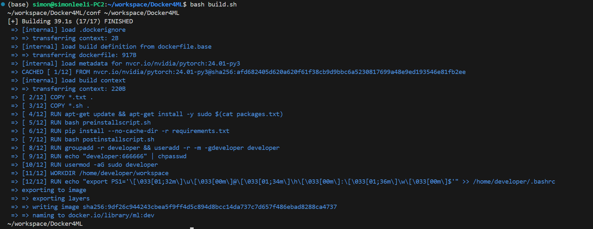
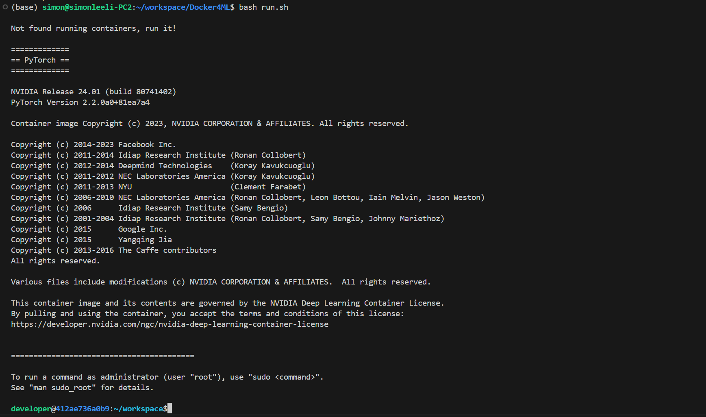

# Docker4ML

Useful docker scripts for ML developement.
[https://github.com/SimonLeeGit/Docker4ML](https://github.com/SimonLeeGit/Docker4ML)

## Build Docker Image

```bash
bash build.sh
```



## Run Docker Container as Development Envirnoment

```bash
bash run.sh
```



## Custom Docker Config

### Config [setup_env.sh](./conf/setup_env.sh)

You can modify this file to custom your settings.

```bash
# Docker tag for new build image
TAG=ubuntu:dev

# Base docker image tag used by docker build
BASE_TAG=ubuntu:latest

# User name used in docker container
USER_NAME=developer

# User password used in docker container
USER_PASSWD=666666
```

#### TAG

Your built docker image tag, you can set it as what you what.

#### BASE_TAG

The base docker image tag for your built docker image, here we use ubuntu images.
You can check it from [https://hub.docker.com/_/ubuntu/tags](https://hub.docker.com/_/ubuntu/tags)

### USER_NAME

Your user name used in docker container.

### USER_PASSWD

Your user password used in docker container.

### Config [requriements.txt](./conf/requirements.txt)

You can add your default installed python libraries here.

```txt
transformers==4.27.1
```

### Config [packages.txt](./conf/packages.txt)

You can add your default apt-get installed packages here.

```txt
python3
python3-pip
```

### Config [ports.txt](./conf/ports.txt)

You can add some ports enabled for docker container here.

```txt
-p 6006:6006
-p 8080:8080
```

### Config [*installscript.sh]

- [preinstallscript.sh](./conf/preinstallscript.sh): executed before pip installation
- [postinstallscript.sh](./conf/postinstallscript.sh): executed after pip installation

You can add your custom script to run when build docker image.

```bash
ln -s /usr/bin/python3 /usr/bin/python
```

## Q&A

If you have any use problems, please contact to <simonlee235@gmail.com>.
